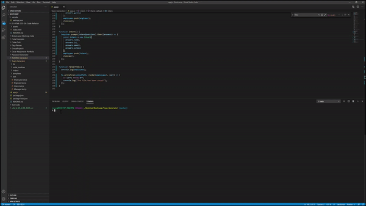

### **Team Generator**

## Description

Team Generator is a command line application that builds a software engineering team.The application will prompt the user for information about the team manager and then information about the team members. The user can input any number of team members, and they may be a mix of engineers and interns.

## Table of contents

- [Description](#Description)
- [Installation](#Installation)
- [Usage](#Usage)
- [License](#License)
- [Contributors](#Contributors)
- [Test](#Test)
- [GitHub Info](#Questions)

## Installation

To run this application first you nust run npm install after just type node app.js in the command line.

## Usage

This application assist the user in creating a software engineering team, when the user has completed building the team, the application will create an HTML file with the rostr. The user can use this to have quick access to emails and GitHub profiles.

## Screenshots

How it works:

Example of HTML Generated:

## License

## Contributors

No contributing guidelines

## Test

used Jest to test this application npm run test

## Questions

For questions contact ooledezma@gmail.com.
GitHub URL: https://api.github.com/users/ooledezma
